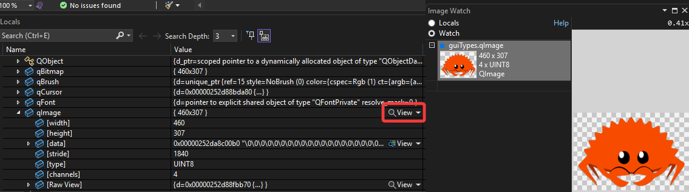

# Nativs4Qt - Install natvis files for Qt

This repository contains:

- Up to date natvis files for Qt5 and Qt6
- Command line tool to install or update them in different locations

## Installation

`natvis4qt` is a simple command line tool to install or update the natvis files in different locations.

> [!CAUTION]
> The tool is in early stage, for now it can only overwrite natvis file in known locations. More later!

### Installation via [Scoop](https://scoop.sh/) (preferred)

```batch
scoop bucket add narnaud https://github.com/narnaud/scoop-bucket
scoop install natvis4qt
```

### Or via archive files

1. Go to the [Releases](https://github.com/narnaud/natvis4qt/releases) page
2. Download the latest `natvis-x86_64-pc-windows-msvc.zip` file
3. Extract the files from it into a directory.

## Usage

Just run `natvis4qt install` on the command line and follow the instructions.


The application is using different commands:

- `install`  Install the natvis files in known directories (MSVC and Qt)
- `update`   Update the natvis files
- `set`      Adjust natvis4qt's settings

## Integration

### Visual Studio

Select `Visual Studio 2019` and/or `Visual Studio 2022` when installing the natvis files.

This will install the natvis files in a central place that is used by Visual Studio. See documentation here: [Natvis file locations](https://learn.microsoft.com/en-us/visualstudio/debugger/create-custom-views-of-native-objects?view=vs-2022#BKMK_natvis_location)

Some visulaizers require debug symbols for Qt to be loaded. To load them, add the `bin` directory of your Qt installation (e.g. `C:\Qt\6.8.0\msvc2022_64\bin`) to the symbol search path under **Options > Debugging > Symbols**.

> [!CAUTION]
> The Qt VS Addin must be deactivated, as it is silently overwriting the natvis files in the Visualizers directory, see [QTVSADDINBUG-1308](https://bugreports.qt.io/browse/QTVSADDINBUG-1308).

#### Image Watch

It is possible to visualize `QImage` and `QPixmap` using the [Image Watch](https://learn.microsoft.com/en-us/previous-versions/visualstudio/visual-studio-2015/debugger/image-watch/image-watch) extension from Microsoft.



Install the extension, and click on the "View" button. It will open a new window with the image.

> [!WARNING]
>
> - it only supports image in RGB(A) with 32bits/pixel,
> - the Qt natvis file must to be in the default [Natvis file locations](https://learn.microsoft.com/en-us/visualstudio/debugger/create-custom-views-of-native-objects?view=vs-2022#BKMK_natvis_location).

### Visual Studio Code

#### Central Natvis file locations

Select `VS Code C/C++ Extension` when installing the natvis files.

This will install the natvis files in a central place that is used by Visual Studio. See available "documentation" here: [Natvis file locations](https://github.com/microsoft/vscode-cpptools/issues/925#issuecomment-591483777).

> [!WARNING]
> The files may disappear after an update of the [Microsoft C/C++ extension](https://marketplace.visualstudio.com/items?itemName=ms-vscode.cpptools).

#### Per-project vizualizer file

Another option is to install the natvis files int eh different Qt directories, and set a `visualizerFile` to your launch configuration. Edit your `launch.json` file (or the `launch` section of your `*.code-workspace` file) and add something like that:

```json
    "configurations": [
        {
            "name": "Current Target (VS)",
            "type": "cppvsdbg",
            "request": "launch",
            "program": "${command:cmake.launchTargetPath}",
            "visualizerFile": "${env:QTDIR}/natvis/qt6.natvis",
            "cwd": "${workspaceFolder}",
            "sourceFileMap": {
                "C:/work/build/qt5_workdir/w/s": "${env:QTDIR}/../Src",
                "Q:/qt5_workdir/w/s": "${env:QTDIR}/../Src",
                "C:/Users/qt/work/install": "${env:QTDIR}/../Src",
                "C:/Users/qt/work/qt": "${env:QTDIR}/../Src"
            },
            "symbolOptions": {
                "searchPaths": ["${env:QTDIR}/bin"],
            }
        }
    ]
```

> [!IMPORTANT]
>
> - The `QTDIR` environment variable must be set up before launching VS Code
> - You are limited to **only one** vizualizer file with `cppvsdbg`, see related [issue](https://github.com/microsoft/vscode-cpptools/issues/10917).

## Update

If you have installed `natvis4qt` using scoop, installed Natvis files will be automatically updated when updating via scoop.
If you don't want this mechanism, run:

```cmd
natvis4qt set --autoupdate false
```

To update them by hand, just run:

```cmd
natvis4qt update
```

## Natvis files

If you are only interested in natvis files, you can find them here:

- [qt5.natvis](https://github.com/narnaud/natvis4qt/releases/latest/download/qt5.natvis)
- [qt6.natvis](https://github.com/narnaud/natvis4qt/releases/latest/download/qt6.natvis)

> [!CAUTION]
>
> - *Do not use the natvis files in the source repository*, as they are merged during the release.
> - **Always** use the ones from the release.

You can find the current support of the Natvis file here: [SUPPORT.md](SUPPORT.md)

## License

The **natvis4qt** tool is licensed under the MIT license.

`qt5.natvis`:

- [The Qt Company](https://www.qt.io/): licensed Qt-Commercial OR GPL-3.0-only WITH Qt-GPL-exception-1.0

`qt6.natvis`:

- [The Qt Company](https://www.qt.io/): licensed Qt-Commercial OR GPL-3.0-only WITH Qt-GPL-exception-1.0
- [QMap](https://github.com/qt-labs/vstools/commit/97dd70cd5b1c3c9a310377f03bf2a989d60bb1b1), [QHash](https://github.com/qt-labs/vstools/commit/71e0e9e7fecc6c1077c90a5ec739f5d89dcf5fa5), [QSet](https://github.com/qt-labs/vstools/commit/86270320212a8a9c7d3749613c4b5c189e2569fa) and [QVariant](https://github.com/qt-labs/vstools/commit/d21e92652c9728fb0512813f6938588b16ac39d1) are copyright [Klarälvdalens Datakonsult AB (KDAB)](https://www.kdab.com/)

`qt6-extension.natvis`:

- [@nholthaus](https://github.com/nholthaus): licensed MIT
- [Klarälvdalens Datakonsult AB (KDAB)](https://www.kdab.com/): licensed MIT
- [@nerixyz](https://github.com/Nerixyz): licensed MIT

`qt6-json.natvis`:

- [@aleksey-nikolaev](https://github.com/aleksey-nikolaev): licensed MIT
- [@nerixyz](https://github.com/Nerixyz): licensed MIT
